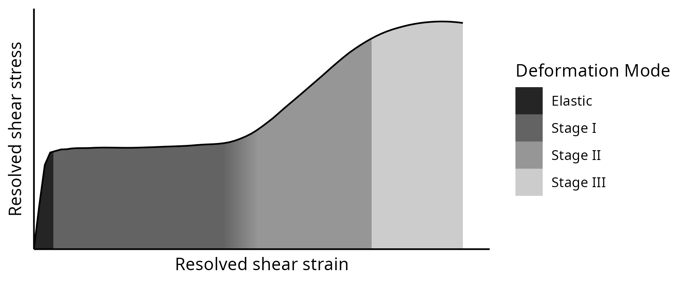
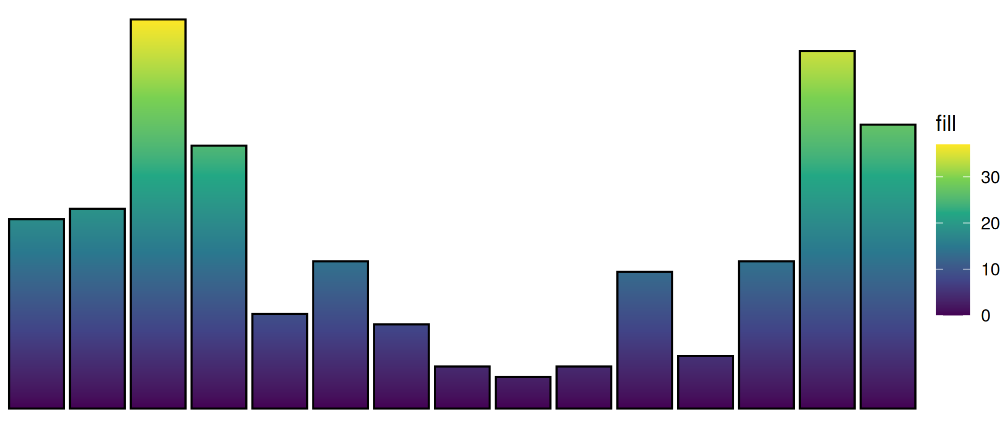
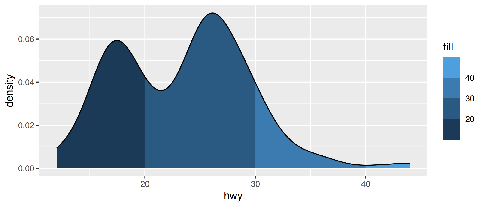
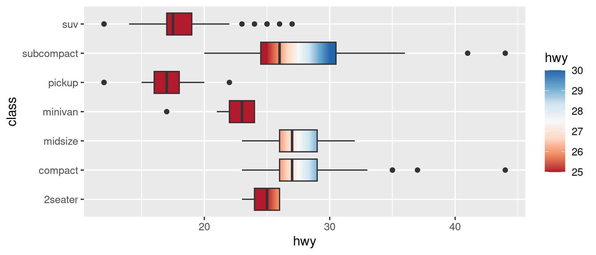

<!-- README.md is generated from README.Rmd. Please edit that file -->

# gggradient

<!-- badges: start -->

[](https://lifecycle.r-lib.org/articles/stages.html#experimental)
[](https://CRAN.R-project.org/package=gggradient)
<!-- badges: end -->



The goal of gggradient is to leverage the power of ggplot2 scale syntax
to interface with the flexibility of `grid::linearGradient()` patterns.

## Installation

You can install the development version of gggradient from GitHub like
so:

``` r
# install.packages("pak")
pak::pak("hrryt/gggradient")
```

## Examples

Easily create a gradient fill along a geometry:

``` r
library(ggplot2)
library(gggradient)

ggplot(mpg, aes(manufacturer, fill = 1)) +
    geom_bar(colour = "black") +
    scale_fill_y_viridis_c() +
    theme_void()
```



Discretise gradients with binned scales:

``` r
ggplot(mpg, aes(hwy, fill = 1)) +
  geom_density() +
  scale_fill_x_binned()
```



Flexibly specify gradients with the syntax of regular fill scales:

``` r
ggplot(mpg, aes(hwy, class, fill = 1)) +
    geom_boxplot() +
    scale_fill_x_distiller(
        name = "hwy",
        limits = c(25, 30),
        oob = scales::oob_squish,
        palette = "RdBu",
        direction = 1,
        group = FALSE
    )
```


